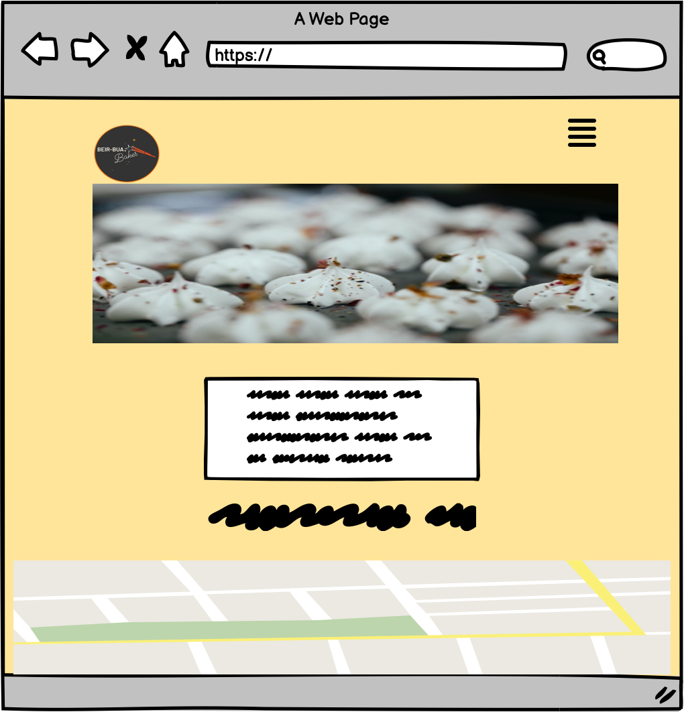
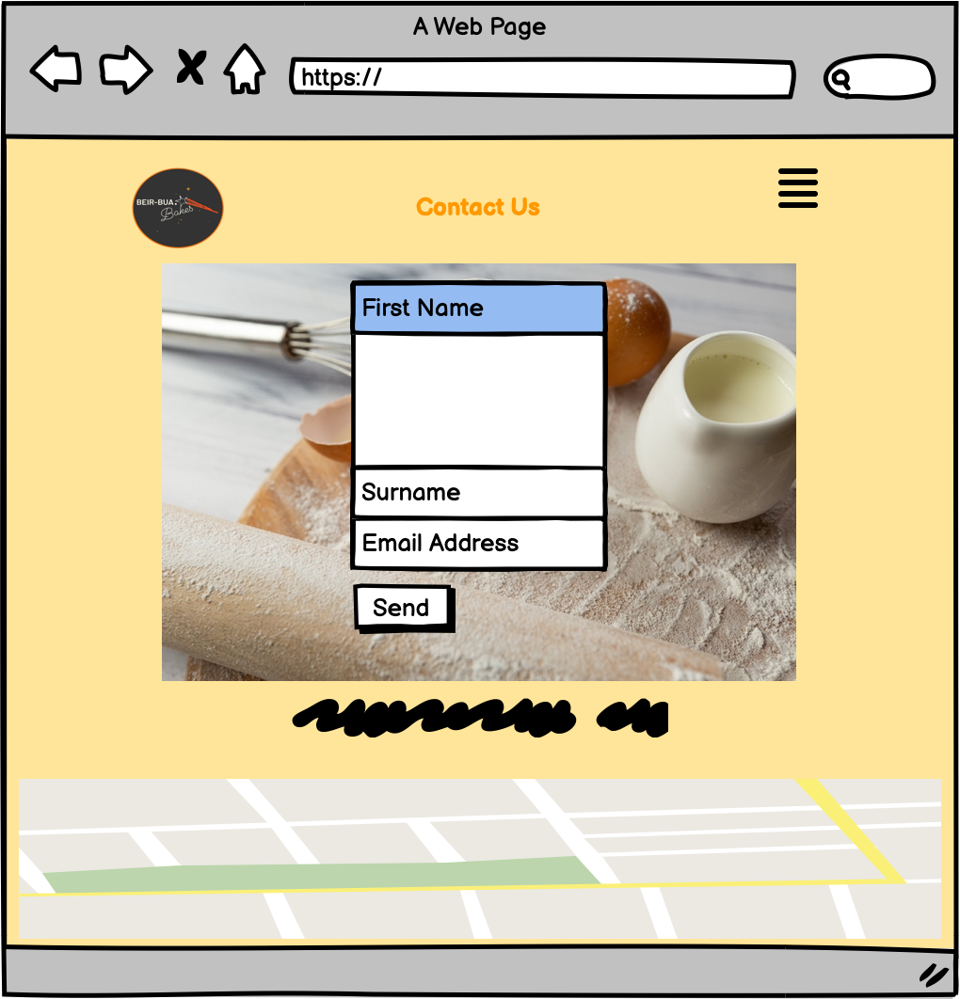
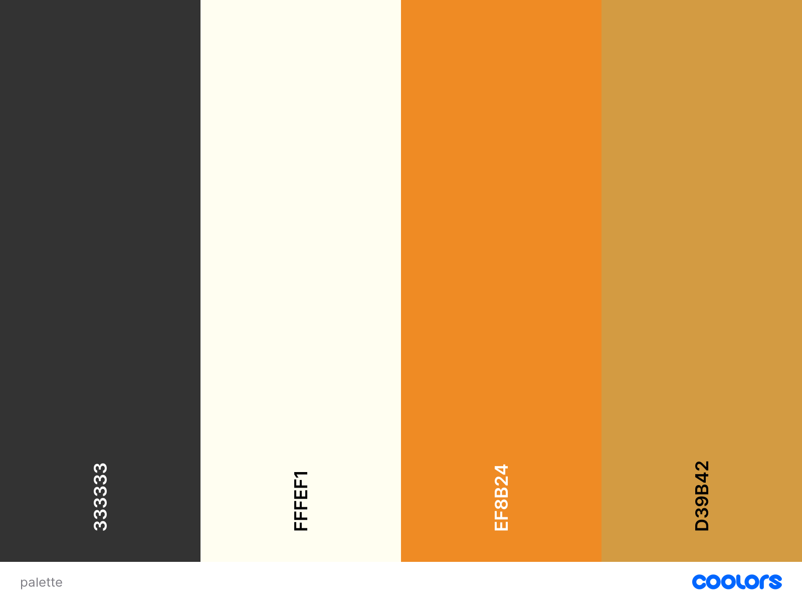

# Beir Bua Bakes
 Beir Bua Bakes is a website for a Baker in Co. Louth, that creates fresh, exciting and delicious bakes for all. 

The site consists of three pages, being the Home page, the Our Bakes page and the Contact Us page. The Website is very easy to navigate and use.

## Inception and Initial Design

I had a rough idea, in my head, of how I wanted to the website to look like, after a project inception meeting with my mentor, he reccommended that I use Balsamiq to draft out some rough mock-up wireframes of how I wanted to design the website. These were the designs, which I believe match the finished project. 

## Features

### Hamburger Menu
* I placed a dropdown hamburger menu at the top-right corner of the website. 
* The menu gnavigates the user through to the 'Home,' 'Our Bakes' and "Contact Us' pages. 
* The menu sections are decorated with icons from fontawesome.com. 

### Header 

* The header features the Bakery's logo, along with their tagline 'The Artisan Way, Since 2021.'
* The header also features a hero image, which is a stock image from pexels.com that suits the colour scheme of the website.

### Our Bakes 

* The second page of the webiste features six of the most popular bakes by the Bakery. 
* Each bakes are alligned in opposite directions, per-row, along with a short descriptive paragraph in their box divs.
* The designed box divs are based off the company logo, with the rgb charcoal and orange colors, taken from the logo, using an eyedropper tool. 

### Contact Us 

* The Contact Us section features a form, that sits over a background stock image from pexels.com, that suits the colour-scheme of the website. 
* The form is linked to the Code Institute formdump website. 

### Footer 

* The footer features a hyperlink to the Bakery's Instagram page, that opens on a new tab.
* Below the link, there is a Google Map box with the Bakery's address. 

## Colour scheme and design 

The colour scheme of the website, was based on their colours that feature in the company's logo. Using imagecolorpicker.com, I was able to isolate and identify the RGB values for the different colours that I wanted to use for the website. See the RBG colour palette, below the company logo, created on coolors.com.

